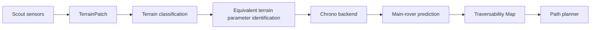

# Scout-to-Main Rover Mobility Twin MVP

정찰로버의 지형 및 주행 반응 측정값을 입력받아, 제원이 다른 메인로버의 지형 통과 위험도를 물리식과 휴리스틱으로 계산하고 Traversability Map으로 시각화하는 독립 실행형 Python MVP입니다.

## 설치

```bash
cd mobility_twin_mvp
pip install -r requirements.txt
```

## 실행

```bash
pytest
streamlit run app.py
```

## Integration Skeleton

이번 버전은 완성된 rover 또는 terrain 모델을 가정하지 않고, 팀별 산출물이 나중에 들어올 수 있는 교체형 skeleton을 포함합니다.

```text
RoverSpec + TerrainScenario + ControlProfile
  -> MobilityBackend
  -> SimulationResult
  -> Risk Fusion / Streamlit / JSON artifact
```

현재 backend는 두 가지입니다.

- `heuristic`: 기존 MVP 물리식과 risk fusion을 `MobilityBackend` 인터페이스 뒤로 감싼 fallback backend입니다.
- `mock_chrono`: 실제 PyChrono, CAD, collision, wheel, SCM/DEM 모델을 만들지 않는 placeholder입니다. 최종 `SimulationResult` 계약만 검증합니다.

### Handoff 파일 위치

호진님 rover 모델 팀:

```text
rover_models/<rover_id>/rover.yaml
```

필수 schema는 `RoverSpec`입니다. 모든 단위는 SI입니다. `model_uri`에는 향후 CAD, collision, Chrono vehicle factory 위치를 넣을 수 있지만, 현재 MVP는 이 값을 실행하지 않습니다.

종민님 terrain 모델 팀:

```text
terrain_scenarios/<terrain_id>/terrain.yaml
```

필수 schema는 `TerrainScenario`와 `ObstacleSpec`입니다. 모든 길이 단위는 meter입니다. 실제 height map, mesh, SCM parameter, DEM particle pack은 아직 직접 연결하지 않고, 향후 terrain factory에서 교체합니다.

제어/실험 담당:

```text
control_profiles/<profile_id>.yaml
```

필수 schema는 `ControlProfile`입니다. 속도는 `m/s`, 시간은 `s`, 조향은 degree입니다.

샘플 scenario:

- `T01_flat`
- `T02_slope`
- `T03_single_rock`
- `T04_rock_field`

Streamlit에서 rover model, terrain scenario, control profile, backend를 선택하고 `Run Experiment`를 누르면 `data/experiment_results/<experiment_id>.json`에 `SimulationResult`가 저장됩니다.

### Schema 정의 요약

`RoverSpec`: `rover_id`, `display_name`, `mass_kg`, `wheel_radius_m`, `wheel_width_m`, `wheelbase_m`, `track_width_m`, `cg_height_m`, `ground_clearance_m`, `driven_wheel_count`, `max_wheel_torque_nm`, `mu_eff`, `crr`, `model_uri`, `metadata`.

`ObstacleSpec`: `obstacle_id`, `kind`, `x_m`, `y_m`, `height_m`, `width_m`, `length_m`, `radius_m`, `metadata`.

`TerrainScenario`: `terrain_id`, `display_name`, `terrain_type`, `surface_hint`, `slope_long_deg`, `slope_lat_deg`, `roughness_m`, `gap_width_m`, `obstacles`, `scout_response`, `patch_id`, `grid_x`, `grid_y`, `metadata`.

`ControlProfile`: `profile_id`, `display_name`, `target_speed_mps`, `duration_s`, `throttle`, `steering_deg`, `drive_mode`, `metadata`.

`SimulationResult`: `experiment_id`, `backend_name`, `rover_id`, `terrain_id`, `control_profile_id`, `status`, `started_at_utc`, `duration_s`, `metrics`, `risk_components`, `final_risk`, `grade`, `hard_failure_reasons`, `notes`, `artifacts`.

### 실제 Chrono 연결 시 교체 위치

`src/backends.py`의 `MockChronoBackend`를 실제 `PyChronoBackend`로 교체합니다. 이때 다음 factory를 추가하는 구조를 권장합니다.

- `rover_factory`: 호진님 rover spec과 `model_uri`를 Chrono vehicle/wheel/contact 모델로 변환
- `terrain_factory`: 종민님 terrain scenario를 rigid terrain, SCM terrain, DEM terrain, mesh/height map 등으로 변환
- `control_adapter`: `ControlProfile`을 Chrono driver input 또는 controller로 변환
- `result_extractor`: Chrono pose, slip, sinkage, wheel torque, contact, energy 로그를 `SimulationResult.metrics`로 변환

기존 `risk_fusion.py`와 Streamlit risk map은 `SimulationResult`와 CSV risk 결과를 함께 소비하도록 유지합니다.

## 입력과 출력

입력은 `data/sample_patches.csv`의 patch 단위 측정값입니다. 주요 입력은 grid 좌표, 종경사/횡경사, roughness, obstacle height, gap width, scout slip, scout sinkage, scout wheel torque, scout COT, vibration, surface hint입니다.

출력은 지형 분류, 물리 계산값, 0~1 위험도 구성 요소, 최종 risk score, Safe/Caution/Risk/Unknown 등급, hard failure 이유, 그리고 2D Traversability Map입니다.

## 계산식

경사각 `alpha`는 종경사 degree의 절댓값을 radian으로 변환합니다.

```text
F_req = m * g * sin(alpha) + Crr * m * g * cos(alpha)
F_torque = driven_wheel_count * max_wheel_torque / wheel_radius
F_friction = mu_eff * m * g * cos(alpha)
F_avail = min(F_torque, F_friction)
traction_margin_n = F_avail - F_req
traction_margin_ratio = (F_avail - F_req) / max(F_req, 1.0)
beta_crit_deg = degrees(atan((track_width / 2) / cg_height))
tipover_margin_deg = beta_crit_deg - abs(slope_lat_deg)
obstacle_ratio = obstacle_height / wheel_radius
gap_ratio = gap_width / (2 * wheel_radius)
clearance_ratio = obstacle_height / ground_clearance
```

Scout slip/sinkage는 메인로버로 직접 복사하지 않고 MVP용 scaling heuristic으로 변환합니다.

```text
pressure_ratio = (main_mass / main_driven_wheel_count) / reference_scout_wheel_load
predicted_main_sinkage =
  scout_sinkage
  * sqrt(max(pressure_ratio, 0.1))
  * sqrt(reference_scout_wheel_width / main_wheel_width)

predicted_main_slip =
  clip(
    scout_slip
    * sqrt(max(pressure_ratio, 0.1))
    * sqrt(reference_scout_wheel_radius / main_wheel_radius),
    0,
    1
  )
```

개별 위험도는 traction, tipover, obstacle, gap, slip, sinkage, energy, vibration, uncertainty로 계산합니다. 최종 위험도 기본 가중치는 traction 0.22, tipover 0.18, obstacle 0.15, gap 0.10, slip 0.15, sinkage 0.10, energy 0.05, vibration 0.05입니다.

Hard failure 조건은 `F_avail <= F_req`, `tipover_margin_deg <= 0`, `obstacle_height >= ground_clearance`, `gap_width >= wheel_diameter`, `predicted_main_slip >= 0.8`입니다.

## 아키텍처



이번 MVP에서는 `Equivalent terrain parameter identification`과 `Chrono backend`를 실제 Project Chrono 호출 대신 `mobility_physics.py`와 `risk_fusion.py`의 휴리스틱 계산 모듈로 대체했습니다. 인터페이스와 데이터 흐름을 먼저 고정해 향후 backend 교체가 가능하도록 구성했습니다.

## 현재 MVP의 한계

ROS/ROS 2, 실제 센서 드라이버, Project Chrono 직접 호출, DEM/SCM 최적화, 머신러닝 학습은 포함하지 않습니다. Slip/sinkage scaling은 검증된 최종 모델이 아니며, scout와 main rover의 접지 압력 차이를 빠르게 반영하기 위한 개념 검증용 휴리스틱입니다.

## 향후 Chrono 연결 계획

`ScoutMeasurement`를 `TerrainPatch` 입력으로 유지하고, 현재 휴리스틱 모듈 자리에 등가 지형 파라미터 추정기와 Chrono backend adapter를 추가합니다. Chrono 결과는 현재 `MobilityPhysicsResult`와 호환되는 예측값으로 변환해 Streamlit UI, risk fusion, Traversability Map을 그대로 재사용하는 방향입니다.
